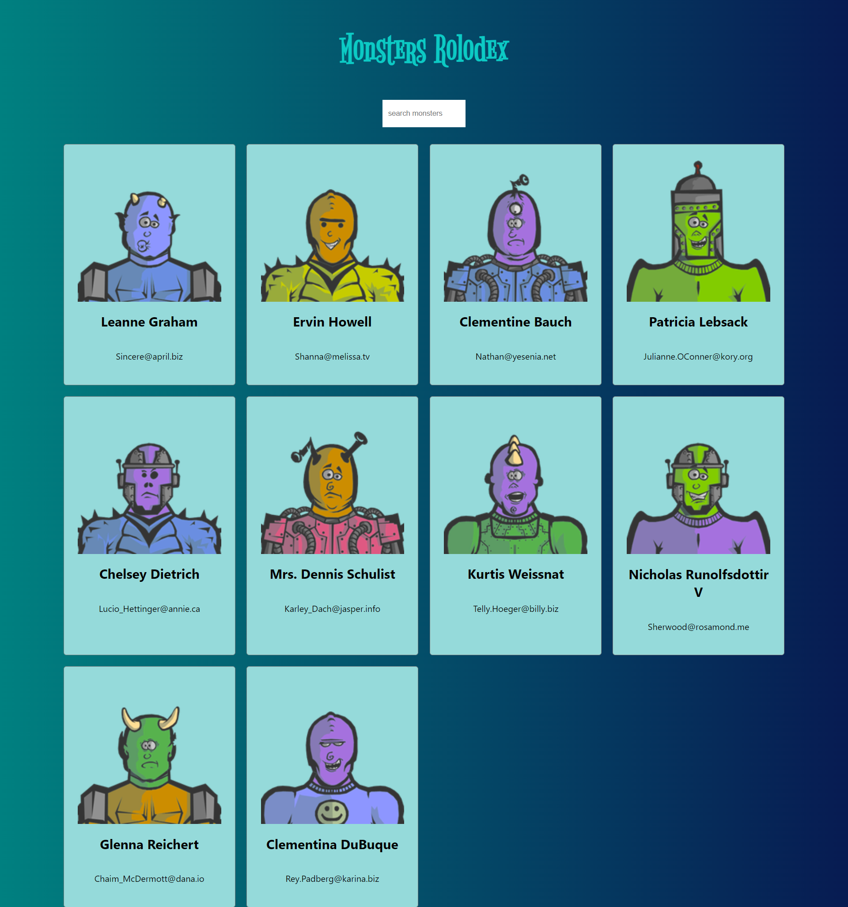

# Monster Rolodex.

#### Monster Rolodex is a basic monsters site.

<br />

### ⚒ Project Demo:

Experience the project in action by visiting our live demo: [Monster Rolodex](https://monster-rolodex-web-demo.vercel.app/)

---

### 🕵️‍♂️ Project Details:

Monster Rolodex is a fun moster search site made using React.

---

### ⚙ Dockerized Execution:

To run project using Docker run the following commands:

For Development:

```bash
  docker build -f Dockerfile.dev -t <tag-name> .

  docker run -p 3000:3000 <tag-name>
```

For Production:

```bash
  docker build -f Dockerfile.prod -t <tag-name> .

  docker run -p 80:3000 <tag-name>
```

---

### 🤹‍♂️ Skills Utilized:

&nbsp;&nbsp;&nbsp;&nbsp;
&nbsp;&nbsp;&nbsp;&nbsp;
&nbsp;&nbsp;&nbsp;&nbsp;
&nbsp;&nbsp;&nbsp;&nbsp;
&nbsp;&nbsp;&nbsp;&nbsp;

---

### ✔ Contributors:

We would like to acknowledge the following contributor for their valuable contributions to this project:

<p align="center">
  <a href="https://github.com/faraasat">
    
  </a>&nbsp&nbsp&nbsp&nbsp&nbsp&nbsp&nbsp&nbsp&nbsp&nbsp&nbsp&nbsp
</p>

---

### 📷 Project UI:

Take a glimpse into the captivating world of Natours Tour Static Website:

<p align="center">
  <a href="https://monster-rolodex-web-demo.vercel.app/">
    
  </a>
</p>
